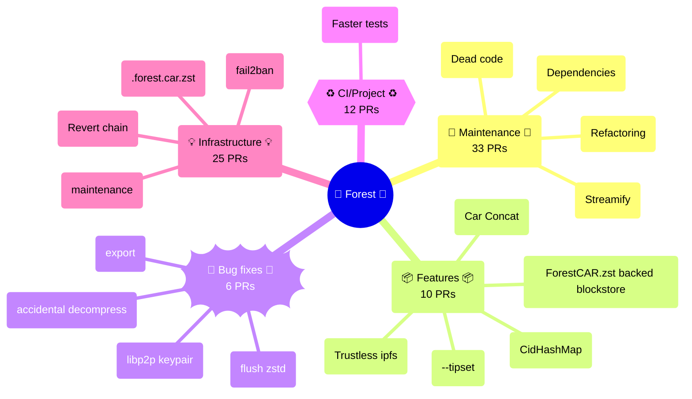
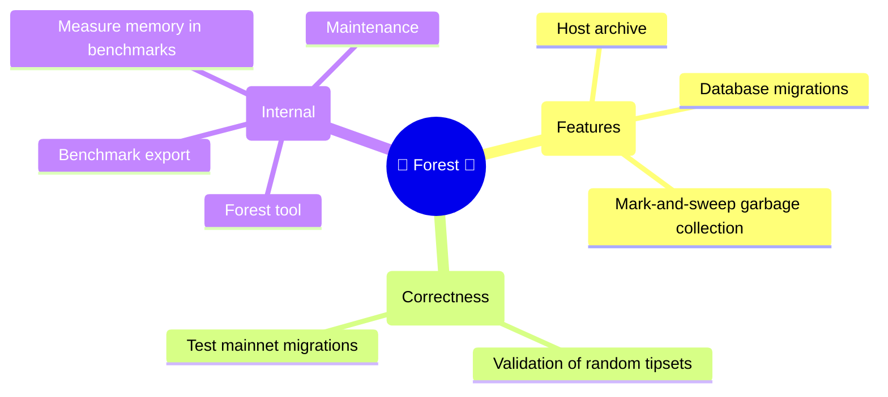

# Mindmap of Forest work: 2023-07-15 and 2023-07-31

```mermaid
mindmap
  root((🌲 Forest 🌲))
    id(👷 Maintenance 👷<br>33 PRs)
      (Dead code)
      (Dependencies)
      (Streamify)
      (Refactoring)
    id(📦 Features 📦<br>10 PRs)
      (ForestCAR.zst backed blockstore)
      (CidHashMap)
      (Trustless ipfs)
      (\-\-tipset)
      (Car Concat)
    id))🐞 Bug fixes 🐞<br>6 PRs((
      (flush zstd)
      (accidental decompress)
      (libp2p keypair)
      (export)
    id{{♻ CI/Project ♻<br>12 PRs}}
      (Faster tests)
    id(💡 Infrastructure 💡<br>25 PRs)
      (Revert chain)
      (fail2ban)
      (.forest.car.zst)
      (maintenance)
```

                

# Sprint goals:

```mermaid
mindmap
  root((🌲 Forest 🌲))
    id(Features)
      Host archive
      Database migrations
      Mark-and-sweep garbage collection
    id(Correctness)
      Validation of random tipsets
      Test mainnet migrations
    id(Internal)
      Forest tool
      Benchmark export
      Measure memory in benchmarks
      Maintenance
```
